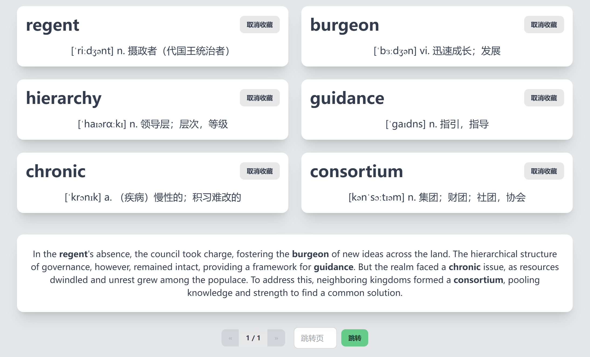
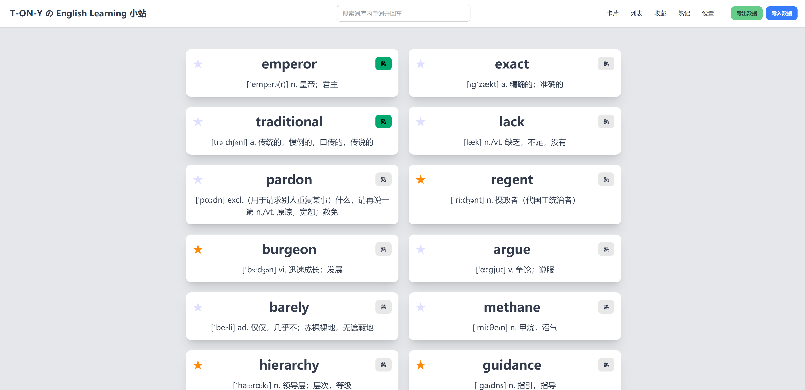

# 📖 SmartWord

## 🌟 项目简介
本项目是一个结合了大语言模型的高效、智能的背单词网站，旨在帮助用户通过多种记忆方式更好地掌握英语单词。支持多种特色功能，且持续维护中。

你可以直接在[T-ON-Y的英语学习小站](https://english.tonywu.top)中在线体验

## 🎯 主要功能
- **单词卡片**：以卡片形式展示要记忆的单词
- **收藏单词**：收藏单词功能，可在收藏页查看
- **熟记单词**：标记熟记单词，熟记的单词不会在记忆卡片中出现
- **AI教学**：在卡片中生成单词的解释，例句和近/反义词
- **连词成句**：使用AI把词库中的多个单词串成一篇英文文章
- **主题切换**：更改网页主题

## 🏗️ 技术栈

前端：HTML / JavaScript / CSS / Tailwind CSS / DaisyUI

存储：LocalStorage

部署：GitHub Pages / Vercel / Netlify

## 🚀 贡献指南
欢迎任何形式的贡献！
1. 提交 PR
2. 提交 issues
3. 赞助作者
以下为项目贡献者：
* SugarSong404

## 📜 许可证
本项目基于 MIT 许可证开源，欢迎自由使用和修改。

---

💡 **欢迎 Star 和 Fork，一起打造更好的单词学习体验！**

